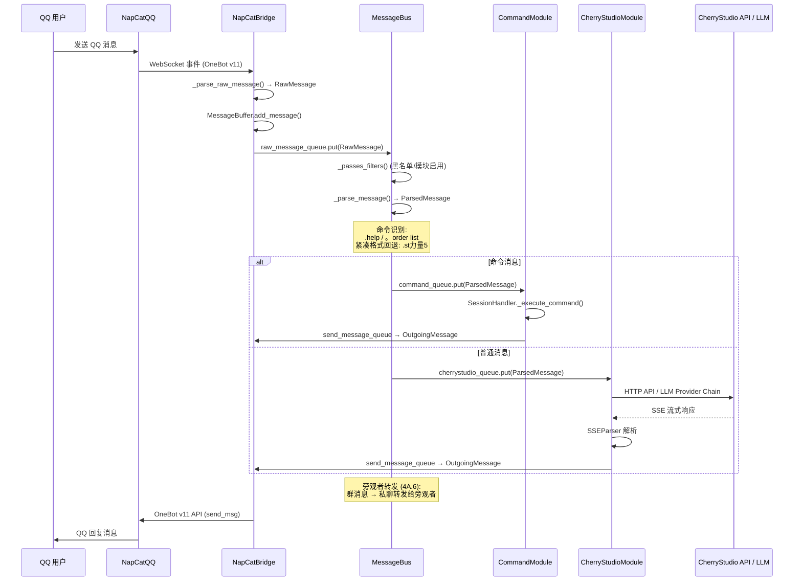

# QQ-MCP Bridge v3.0 系统结构文档

> **版本**: 3.0.0
> **包名**: `cherrystudio-qq-mcp`
> **运行环境**: Python >= 3.10
> **最后更新**: 2026-06

---

## 目录

1. [项目概述](#1-项目概述)
2. [系统架构总览](#2-系统架构总览)
3. [消息流水线](#3-消息流水线)
4. [核心模块详解](#4-核心模块详解)
5. [辅助模块](#5-辅助模块)
6. [数据流与持久化](#6-数据流与持久化)
7. [配置体系](#7-配置体系)
8. [部署与运行](#8-部署与运行)

---

## 1. 项目概述

QQ-MCP Bridge v3.0 是一个基于 Python 异步架构的消息桥接系统，其核心使命是**将 QQ 即时通讯能力（通过 NapCatQQ / OneBot v11 协议）与 CherryStudio AI Agent 平台无缝对接**。

系统运行后，QQ 用户发送的群聊或私聊消息将被自动路由至 CherryStudio 的 AI Agent 进行处理，Agent 的回复则通过 MCP（Model Context Protocol）工具回传至 QQ，实现双向智能对话。

### 1.1 核心目标

- **QQ 协议接入**: 通过 NapCatQQ 提供的 WebSocket 接口，基于 OneBot v11 标准协议收发 QQ 消息
- **AI Agent 对接**: 通过 CherryStudio HTTP API 和 MCP STDIO 传输与 AI Agent 交互
- **多模型容灾**: 支持多 LLM Provider 链式回退，单个模型故障时自动切换
- **命令插件系统**: 提供可扩展的命令体系，支持自动发现与热重载
- **会话持久化**: 按群/私聊独立管理会话，支持过期摘要压缩与记忆恢复

### 1.2 技术栈

| 层面 | 技术选型 |
|------|---------|
| 语言 | Python 3.10+ |
| 异步框架 | asyncio + aiohttp + websockets |
| 协议 | MCP (Model Context Protocol) + OneBot v11 |
| 构建系统 | hatchling |
| 数据校验 | pydantic >= 2.0.0 |
| MCP SDK | mcp >= 1.0.0 (FastMCP) |

---

## 2. 系统架构总览

### 2.1 架构图

```mermaid
graph TB
    subgraph QQ["QQ 客户端"]
        QQUser["QQ 用户"]
    end

    subgraph NapCat["NapCatQQ"]
        NCWS["WebSocket Server<br/>OneBot v11"]
    end

    subgraph Bridge["QQ-MCP Bridge v3.0"]
        subgraph Core["核心模块"]
            Server["Server<br/>server.py<br/>入口 / MCP 注册 / 生命周期"]
            NapCatBridge["NapCatBridge<br/>napcat_bridge.py<br/>WebSocket 客户端 / OneBot API"]
            MessageBus["MessageBus<br/>message_bus.py<br/>过滤 → 解析 → 路由"]
            CommandModule["CommandModule<br/>command_module.py<br/>命令插件 / 自动发现"]
            CherryStudioModule["CherryStudioModule<br/>cherrystudio_module.py<br/>AI Agent / SSE / LLM 回退"]
        end

        subgraph Support["辅助模块"]
            StateManager["StateManager<br/>state/manager.py"]
            ConvStore["ConversationStore<br/>conversation_store.py"]
            SSEParser["SSEParser<br/>sse_parser.py"]
            Protocols["Protocols<br/>messages.py / error_codes.py"]
        end

        RawQ[("raw_message_queue")]
        CmdQ[("command_queue")]
        CSQ[("cherrystudio_queue")]
        SendQ[("send_message_queue")]
    end

    subgraph CherryStudio["CherryStudio 平台"]
        CSAgent["AI Agent"]
        CSAPI["HTTP API"]
        MCPStdio["MCP STDIO Server"]
    end

    subgraph LLM["LLM 服务"]
        LLM1["Provider 1"]
        LLM2["Provider 2"]
        LLM3["Provider N..."]
    end

    QQUser -->|"QQ 消息"| NCWS
    NCWS <==>"WebSocket"| NapCatBridge
    NapCatBridge -->|"RawMessage"| RawQ
    RawQ -->|"消费"| MessageBus
    MessageBus -->|"ParsedMessage (命令)"| CmdQ
    MessageBus -->|"ParsedMessage (普通)"| CSQ
    CmdQ -->|"消费"| CommandModule
    CSQ -->|"消费"| CherryStudioModule
    CommandModule -->|"OutgoingMessage"| SendQ
    CherryStudioModule -->|"OutgoingMessage"| SendQ
    SendQ -->|"发送循环"| NapCatBridge
    NapCatBridge -->|"OneBot API"| NCWS
    NCWS -->|"QQ 回复"| QQUser

    Server -->|"初始化 / 编排"| NapCatBridge
    Server -->|"初始化 / 编排"| MessageBus
    Server -->|"初始化 / 编排"| CommandModule
    Server -->|"初始化 / 编排"| CherryStudioModule
    Server <==>"MCP STDIO<br/>JSON-RPC 2.0"| MCPStdio

    CherryStudioModule -->|"HTTP API 调用"| CSAPI
    CherryStudioModule -->|"LLM 回退链"| LLM1
    CherryStudioModule -->|"回退"| LLM2
    CherryStudioModule -->|"回退"| LLM3
    CSAPI --> CSAgent

    CherryStudioModule --> ConvStore
    CherryStudioModule --> SSEParser
    MessageBus --> StateManager
    CommandModule --> StateManager
    CherryStudioModule --> StateManager
```

### 2.2 五大核心模块

| 模块 | 文件 | 行数 | 核心职责 |
|------|------|------|---------|
| **Server** | `server.py` | 1140 | 系统入口，配置加载，模块编排，MCP 工具注册，生命周期管理 |
| **NapCatBridge** | `modules/napcat_bridge.py` | 1484 | WebSocket 连接 NapCatQQ，OneBot v11 API 封装，消息收发 |
| **MessageBus** | `modules/message_bus.py` | 332 | 消息过滤、解析、路由分发，非阻塞并发模型 |
| **CommandModule** | `modules/command_module.py` | 418 | 命令插件系统，自动发现，会话级任务隔离 |
| **CherryStudioModule** | `modules/cherrystudio_module.py` | 3175 | AI Agent 交互，SSE 流式解析，LLM 多供应商回退，MCP 客户端 |

---

## 3. 消息流水线

### 3.1 完整消息流



### 3.2 非阻塞并发模型

系统采用**全异步非阻塞**的消息处理模型，核心设计原则如下：

1. **消息分发不等待响应**: `MessageBus._dispatch_message()` 将 `ParsedMessage` 放入对应模块的 `asyncio.Queue` 后立即返回，不阻塞等待模块处理结果
2. **模块独立消费**: `CommandModule` 和 `CherryStudioModule` 各自从队列中消费消息，处理速度互不影响
3. **发送解耦**: 模块将 `OutgoingMessage` 推送到 `MessageBus.send_message_queue`，由独立的 `_send_messages_loop()` 后台任务统一调用 `NapCatBridge.send_message()` 发送
4. **会话级隔离**: `CommandModule` 为每个会话（群/私聊）创建独立的 `SessionHandler`，各会话的命令处理互不干扰
5. **后台任务并行**: 所有模块（NapCatBridge WebSocket 监听、MessageBus 路由、CommandModule 命令处理、CherryStudioModule AI 处理、发送循环）均作为独立的 `asyncio.Task` 并行运行

### 3.3 消息路由规则

`MessageBus._parse_message()` 实现两级命令识别：

**第一级 — 标准格式**:
- 正则 `^[.。]\s*(\w+)\s*(.*)?$`
- 匹配 `.help`、`.order list`、`。bot on` 等标准命令格式
- 支持 `.` 和 `。`（中文句号）两种前缀

**第二级 — 紧凑格式回退**:
- 当标准格式匹配到的命令名包含非 ASCII 字符时触发
- 正则 `^([a-zA-Z]+)(.*)$`
- 从混合字符串中提取 ASCII 前缀作为命令名
- 示例: `.st力量5` → 命令名 `st`，参数 `力量5`

**路由决策**:
- `is_command = True` → 分发到 `command_queue`（CommandModule）
- `is_command = False` → 分发到 `cherrystudio_queue`（CherryStudioModule）
- 分发前检查模块启用状态（`StateManager.is_module_enabled()`）

### 3.4 旁观者消息转发 (4A.6)

`MessageBus._forward_to_observers()` 实现群消息旁观功能：

- 当群消息来自已开启旁观模式的群（`ob_groups`），且该群存在注册的旁观者（`observers`）时
- 将消息内容以私聊形式转发给所有旁观者
- 转发格式: `[旁观] 群 {group_id} — {sender_name}: {content}`
- 不转发给消息发送者本人

---

## 4. 核心模块详解

### 4.1 Server（`server.py` — 1140 行）

Server 是系统的核心编排器，负责配置加载、模块初始化、MCP 工具注册和生命周期管理。

#### 4.1.1 类结构

```
Server
├── __init__(config_path)           # 初始化，确定配置文件路径
├── initialize()                    # 系统初始化 (9 步)
├── start()                         # 创建后台任务
├── shutdown()                      # 优雅关闭
├── _load_config()                  # 加载配置文件
├── _adapt_legacy_config()          # 适配旧配置格式
├── _register_mcp_tools()           # 注册 12 个 MCP 工具
├── _connect_queues()               # 连接模块间消息队列
├── _setup_event_handlers()         # 设置事件处理器
├── _build_bot_greeting()           # 构建机器人入群欢迎
├── _build_member_welcome()         # 构建新成员欢迎
├── _build_friend_greeting()        # 构建好友欢迎
├── _ensure_bot_setting_config()    # BotSettingConfig 自动重建
├── _check_singleton()              # 单例锁 (已禁用)
├── _cleanup_pid_file()             # PID 文件清理 (已禁用)
├── _init_self_qq()                 # 等待连接并获取机器人 QQ 号
└── _send_messages_loop()           # 发送消息循环
```

#### 4.1.2 初始化流程

`initialize()` 按严格顺序执行 9 个步骤：

1. **加载配置** — `_load_config()` 从 `config.json`（根目录优先）或 `Configuration/config.json` 读取，并调用 `_adapt_legacy_config()` 适配旧格式
2. **初始化状态管理器** — `StateManager.initialize()` + `merge_legacy_files()` 双向合并旧持久化文件
3. **初始化 NapCatBridge** — 传入 `ws_host`、`ws_port`、`access_token`，设置 `MessageBuffer` 大小、文档阈值、最大重连次数
4. **初始化 MessageBus** — 传入 `StateManager`，构建过滤器链
5. **初始化 CommandModule** — 传入 `StateManager`、`NapCatBridge`、`config`，加载内置命令
6. **初始化 CherryStudioModule** — 传入 `StateManager`、`config`，初始化 MCP 客户端和 HTTP 客户端
7. **初始化 MCP Server** — 创建 `FastMCP` 实例，注册 12 个标准工具
8. **连接模块队列** — `_connect_queues()` 建立所有 `asyncio.Queue` 连接
9. **设置事件处理器** — `_setup_event_handlers()` 注册入群欢迎、好友审批等回调

#### 4.1.3 MCP 工具注册

`_register_mcp_tools()` 注册 12 个标准工具，供 CherryStudio Agent 通过 MCP 协议调用：

| 工具名 | 功能 | 关键参数 |
|--------|------|---------|
| `qq_send_message` | 发送文本消息 | `message_type`, `target_id`, `message` |
| `qq_send_image` | 发送图片 | `message_type`, `target_id`, `image_url`, `summary` |
| `qq_upload_file` | 上传文件 | `message_type`, `target_id`, `content`/`file_path`, `filename` |
| `qq_get_recent_messages` | 获取本地缓存消息 | `target`, `count` |
| `qq_get_group_msg_history` | 拉取群聊历史消息 | `group_id`, `count` |
| `qq_get_group_list` | 获取群列表 | — |
| `qq_get_friend_list` | 获取好友列表 | — |
| `qq_get_group_members` | 获取群成员列表 | `group_id` |
| `qq_get_user_info` | 获取用户信息 | `user_id` |
| `qq_get_recent_contacts` | 获取最近联系人 | `count` |
| `qq_check_status` | 检查连接状态 | — |
| `qq_recall_message` | 撤回消息 | `message_id` |

所有发送类工具内置**断线自动重试**机制：首次 `ConnectionError`/`TimeoutError` 后等待 2 秒重试一次。`qq_send_message` 还包含**活跃目标验证**（`is_target_active()`），防止向不存在的会话发送消息。

#### 4.1.4 配置适配

`_adapt_legacy_config()` 支持两种配置格式的双向兼容：

- **新格式**: `{"cherrystudio": {"mcp_server_path": "...", "http_api_base": "...", "api_key": "..."}}`
- **旧格式**: `{"cherry_api_key": "...", "agent_api_url": "...", "mcp_server_name": "..."}`

同时标准化键名：
- `llm` → `llm_providers`
- `api_url` → `base_url`（每个 provider 内部）

#### 4.1.5 入口与启动

`main()` 异步入口的启动顺序：

1. Windows 控制台初始化（`FreeConsole` + `AllocConsole`）
2. stderr VT 序列模式启用（Windows 平台）
3. `Server.initialize()` — 配置加载与模块初始化
4. `Server.start()` — 创建后台任务（NapCatBridge、MessageBus、CommandModule、CherryStudioModule、发送循环、InitSelfQQ）
5. **MCP STDIO 服务器启动** — 使用底层 `mcp.server.stdio.stdio_server` + `Server.run()` 复用当前 asyncio 事件循环（避免 `FastMCP.run()` 的 `anyio.run` 冲突）

`main_sync()` 同步入口封装 `asyncio.run(main())`，供 `pyproject.toml` 的 `[project.scripts]` 使用。

#### 4.1.6 单例锁

PID 单例锁机制（`_check_singleton` / `_cleanup_pid_file`）已被**显式禁用**。原因：CherryStudio 频繁重启 MCP 服务器进程，PID 锁会导致启动失败。

---

### 4.2 NapCatBridge（`modules/napcat_bridge.py` — 1484 行）

NapCatBridge 是系统与 NapCatQQ 之间的双向通信桥梁，负责 WebSocket 连接管理和 OneBot v11 API 封装。

#### 4.2.1 类结构

```
MessageBuffer
├── __init__(max_size=200)
├── add_message(msg)               # 添加消息 (全局 + 按目标分桶)
├── get_recent_messages(target, count)  # 获取最近消息
├── has_target(target_id)           # 快速活跃验证
├── get_all_targets()               # 获取所有有记录的目标
└── clear()                         # 清空缓冲区

NapCatBridge
├── __init__(host, port, access_token, message_bus)
├── initialize()                    # 初始化
├── start()                         # WebSocket 主循环 (含重连)
├── stop()                          # 停止
├── send_message(outgoing)          # 发送消息
├── upload_file(type, id, path)     # 上传文件
├── mark_responding(target_id)      # 标记 SSE 响应中
├── unmark_responding(target_id)    # 取消标记
├── is_target_active(target_id)     # 活跃目标验证
├── wait_ready(timeout)             # 等待连接就绪
├── register_notice_handler()       # 注册通知处理器
├── register_request_handler()      # 注册请求处理器
├── _ws_listener()                  # WebSocket 事件监听
├── _parse_raw_message(data)        # 解析 OneBot 消息 → RawMessage
├── _handle_api_response(data)      # 处理 API 响应 (echo → Future)
├── _call_api(action, params)       # 调用 OneBot API (echo-based pending)
└── [30+ OneBot v11 API 方法]
```

#### 4.2.2 WebSocket 连接与重连

- **连接 URL**: `ws://{host}:{port}?access_token={token}`
- **重连策略**: 指数退避，初始延迟 1 秒，最大重连次数可配置（`ws_max_reconnect`，0 = 无限）
- **就绪检测**: 使用 `asyncio.Event`（`_ready`），由 `_init_self_qq()` 后台任务等待就绪后获取登录信息
- **连接等待**: `wait_ready()` 支持超时参数，Server 中先等待 30 秒，失败后再等待 60 秒

#### 4.2.3 OneBot v11 API 覆盖

NapCatBridge 封装了 30+ 个 OneBot v11 标准 API：

**消息类**:
- `send_msg` — 发送消息（私聊/群聊）
- `send_group_msg` / `send_private_msg` — 分类发送
- `delete_msg` — 撤回消息
- `get_msg` — 获取消息详情
- `get_group_msg_history` — 获取群历史消息
- `get_recent_contact` — 获取最近联系人

**信息类**:
- `get_login_info` — 获取登录信息（机器人 QQ 号）
- `get_stranger_info` — 获取用户信息
- `get_group_list` — 获取群列表
- `get_group_info` — 获取群信息
- `get_group_member_list` — 获取群成员列表
- `get_group_member_info` — 获取群成员信息
- `get_friend_list` — 获取好友列表

**操作类**:
- `set_friend_add_request` — 审批好友请求
- `set_group_add_request` — 审批群请求
- `upload_group_file` / `upload_private_file` — 上传文件
- `download_file` — 下载文件

**API 调用机制**: 使用 `echo` 字段作为请求标识，通过 `_pending: dict[str, asyncio.Future]` 映射实现异步请求-响应匹配。每次 API 调用生成唯一 UUID 作为 echo，创建 `Future` 等待响应。

#### 4.2.4 消息缓冲区

`MessageBuffer` 提供双层缓冲机制：

- **全局缓冲**: `deque[RawMessage]`，`maxlen=200`（可配置），按时间顺序缓存所有消息
- **按目标缓冲**: `dict[str, deque]`，键为 `"group:{群号}"` 或 `"private:{QQ号}"`，每个目标独立缓冲
- **线程安全**: 所有操作通过 `asyncio.Lock` 保护

#### 4.2.5 事件处理器

NapCatBridge 支持注册三类事件处理器：

- **消息处理器** (`_on_message_handlers`): 处理收到的聊天消息
- **通知处理器** (`_on_notice_handlers`): 处理系统通知（入群、好友添加等）
- **请求处理器** (`_on_request_handlers`): 处理审批请求（好友申请、群邀请）

Server 在 `_setup_event_handlers()` 中注册了入群欢迎（机器人入群 / 新成员入群）和好友/群自动审批逻辑。

#### 4.2.6 长文本自动转文档

当消息内容超过 `_doc_threshold`（默认 1000 字符，可通过 `auto_reply.doc_threshold` 配置）时，`send_message()` 自动将文本内容保存为临时文件并通过 `upload_file` API 以文件形式发送，避免 QQ 消息长度限制。

---

### 4.3 MessageBus（`modules/message_bus.py` — 332 行）

MessageBus 是系统的消息路由中枢，负责接收原始消息、过滤、解析命令特征，并分发到对应模块。

#### 4.3.1 类结构

```
MessageFilter (基类)
└── should_pass(msg) → bool

BlacklistFilter(MessageFilter)
└── should_pass(msg) → bool    # 检查群是否在黑名单中

ModuleEnabledFilter(MessageFilter)
└── should_pass(msg) → bool    # 检查是否至少有一个模块启用

MessageBus
├── __init__(state_manager)
├── start()                         # 主循环 (非阻塞分发)
├── stop()                          # 停止
├── set_command_queue(queue)        # 设置命令模块队列
├── set_cherrystudio_queue(queue)   # 设置 CherryStudio 模块队列
├── send_response(raw_msg, response)  # 发送模块响应
├── add_filter(filter)              # 添加自定义过滤器
├── remove_filter(filter)           # 移除过滤器
├── _passes_filters(msg)            # 应用所有过滤器
├── _parse_message(raw_msg)         # 解析消息 (命令识别)
├── _dispatch_message(parsed)       # 分发消息到模块
└── _forward_to_observers(parsed)   # 旁观者消息转发
```

#### 4.3.2 过滤器链

`MessageBus` 使用责任链模式，依次应用以下过滤器：

1. **ModuleEnabledFilter** — 如果 `command` 和 `cherrystudio` 模块全部禁用，则丢弃所有消息
2. **BlacklistFilter** — 检查群聊是否在机器人黑名单（`bot_blacklist`）中，黑名单中的群消息全部丢弃

过滤器通过 `StateManager` 查询状态，支持运行时动态变更（通过 `.bot on/off` 命令）。

#### 4.3.3 消息队列

| 队列 | 类型 | 方向 | 用途 |
|------|------|------|------|
| `raw_message_queue` | `asyncio.Queue[RawMessage]` | NapCatBridge → MessageBus | 原始消息输入 |
| `send_message_queue` | `asyncio.Queue[OutgoingMessage]` | 各模块 → Server 发送循环 | 待发送消息输出 |
| `command_queue` | `asyncio.Queue[ParsedMessage]` | MessageBus → CommandModule | 命令消息分发 |
| `cherrystudio_queue` | `asyncio.Queue[ParsedMessage]` | MessageBus → CherryStudioModule | 普通消息分发 |

---

### 4.4 CommandModule（`modules/command_module.py` — 418 行）

CommandModule 实现了可扩展的命令插件系统，支持命令自动发现、依赖注入和会话级任务隔离。

#### 4.4.1 类结构

```
Command (基类)
├── name: str                       # 命令名称
├── description: str                # 命令描述
├── reminder: str                   # 帮助文本中的特殊提醒
└── handle(args, msg, ctx) → str    # 处理方法 (子类实现)

CommandContext (依赖注入容器)
├── state_manager: StateManager
├── napcat_bridge: NapCatBridge
├── config: dict
├── send_queue: asyncio.Queue[OutgoingMessage]
├── command_registry: CommandRegistry
└── cherrystudio_module: CherryStudioModule

CommandRegistry (命令注册表)
├── register(command)               # 注册命令
├── unregister(name)                # 注销命令
├── get(name) → Command             # 获取命令
├── list_all() → list[Command]      # 列出所有命令
├── clear()                         # 清空所有命令
└── discover_builtin()              # 自动发现内置命令

SessionHandler (会话处理器)
├── __init__(session_key, registry, context)
├── start()                         # 启动异步任务
├── stop()                          # 停止
├── add_message(msg)                # 添加消息到队列
├── _run()                          # 主循环 (5 分钟超时)
└── _execute_command(msg)           # 执行命令

CommandModule (模块入口)
├── __init__(state_manager, napcat_bridge, config)
├── initialize()                    # 初始化 (加载内置命令)
├── start()                         # 主循环
├── stop()                          # 停止
├── reload_config()                 # 热重载
└── get_command_list()              # 获取命令列表
```

#### 4.4.2 命令自动发现

`CommandRegistry.discover_builtin()` 从 `modules.commands.builtin` 模块导入并注册 9 个内置命令：

| 命令 | 类名 | 功能 |
|------|------|------|
| `.help` | `HelpCommand` | 显示帮助信息 |
| `.bot` | `BotCommand` | 机器人开关管理 |
| `.order` | `OrderCommand` | Agent 管理（切换、列表） |
| `.model` | `ModelCommand` | 模型偏好管理 |
| `.ob` | `ObCommand` | 旁观者模式管理 |
| `.dismiss` | `DismissCommand` | 解散/退出会话 |
| `.send` | `SendCommand` | 手动发送消息 |
| `.master` | `MasterCommand` | 管理员命令 |
| `.welcome` | `WelcomeCommand` | 欢迎配置管理 |

#### 4.4.3 会话级任务隔离

`CommandModule` 为每个会话（`session_key = "{source}_{target_id}"`）创建独立的 `SessionHandler`：

- **独立消息队列**: 每个 `SessionHandler` 拥有自己的 `asyncio.Queue[ParsedMessage]`
- **独立异步任务**: 通过 `asyncio.create_task()` 启动独立的消费循环
- **5 分钟超时**: 如果 300 秒内没有新消息，`SessionHandler` 自动退出并从 `session_handlers` 字典中移除
- **按需创建**: 新会话到来时自动创建 `SessionHandler`，无需预先分配

#### 4.4.4 依赖注入

`CommandContext` 作为依赖注入容器，为命令提供运行时所需的资源：

- `state_manager` — 全局状态读写
- `napcat_bridge` — QQ 消息发送
- `config` — 系统配置
- `send_queue` — 非阻塞消息发送通道
- `command_registry` — 命令列表查询（用于 `.help`）
- `cherrystudio_module` — Agent 管理（用于 `.order` 命令的 Agent 发现和会话重建）

---

### 4.5 CherryStudioModule（`modules/cherrystudio_module.py` — 3175 行）

CherryStudioModule 是系统中最复杂的模块，负责与 CherryStudio AI 平台的全面交互，包括 MCP 通信、LLM 多供应商回退、视觉处理、文件解析和会话管理。

#### 4.5.1 类结构

```
MCPClient
├── __init__(server_path)
├── connect()                       # 启动子进程并初始化
├── _read_loop()                    # 后台读取响应
├── _handle_response(response)      # 处理 JSON-RPC 响应
├── _send_request(method, params)   # 发送 JSON-RPC 请求
└── _send_notification(method, params)  # 发送通知

LLMProviderChain
├── __init__(providers)
├── call(messages, model_override)  # 链式调用 (含配额检测)
└── _detect_quota_error(response)   # 配额/限流错误检测

VisionProviderChain
├── __init__(providers)
└── call(image_data, prompt)        # 图片识别调用

FileProcessor
├── __init__(config)
└── process(file_path)              # 文件解析 (MinerU)

HTTPClient
├── __init__(base_url, api_key)
├── discover_agents()               # Agent 发现
├── create_session(agent_id)        # 创建会话
├── send_message(session_id, msg)   # 发送消息 (SSE)
├── get_mcp_tools()                 # MCP 工具发现
└── [其他 HTTP API 调用]

CherryStudioSessionHandler
├── __init__(session_key, config, ...)
├── handle_message(parsed_msg)      # 处理消息
├── _stream_sse(response)           # SSE 流式处理
└── _build_context(messages)        # 构建上下文

CherryStudioModule (模块入口)
├── __init__(state_manager, config)
├── initialize()                    # 初始化
├── start()                         # 主循环
├── stop()                          # 停止
├── discover_agents()               # Agent 发现
└── [会话管理 / 工作区上下文 / 过期会话处理]
```

#### 4.5.2 MCP 客户端（MCPClient）

`MCPClient` 通过 STDIO 与 CherryStudio MCP Server 通信，使用 **JSON-RPC 2.0** 协议：

- **连接方式**: 启动 MCP Server 作为子进程（`asyncio.create_subprocess_exec`），通过 stdin/stdout 进行双向通信
- **协议版本**: `2024-11-05`
- **请求-响应匹配**: 使用递增的 `request_id` 和 `pending_requests: dict[str, asyncio.Future]` 实现异步匹配
- **后台读取**: `_read_loop()` 持续读取子进程 stdout，解析 JSON-RPC 响应或通知
- **超时控制**: 请求默认 30 秒超时

#### 4.5.3 LLM 多供应商回退链（LLMProviderChain）

`LLMProviderChain` 实现多 LLM 供应商的链式回退机制：

**调用流程**:
1. 按配置顺序依次尝试各 Provider
2. 每个 Provider 调用失败时自动切换到下一个
3. 所有 Provider 均失败时抛出 `BridgeError(BRG-4004)`

**配额检测**: `_detect_quota_error()` 识别常见的配额/限流错误模式：
- HTTP 429 (Rate Limit)
- HTTP 402 (Payment Required)
- 响应体中包含 `quota`、`balance`、`insufficient`、`rate_limit` 等关键词

**响应格式兼容**: 支持 OpenAI 标准格式（`choices[0].message.content`）和多种变体格式。

#### 4.5.4 视觉处理（VisionProviderChain）

`VisionProviderChain` 独立的视觉模型调用链，用于图片内容识别：

- 使用独立的 `vision_providers` 配置（与 LLM providers 分离）
- 支持 base64 编码图片传输
- 可配置默认视觉模型（`default_vision`）

#### 4.5.5 文件处理（FileProcessor）

`FileProcessor` 负责接收到的文件内容的提取与处理：

- 集成 MinerU 进行文档解析
- 支持 PDF、Word、Excel 等常见格式
- 提取后的文本作为上下文传入 AI Agent

#### 4.5.6 HTTP 客户端（HTTPClient）

`HTTPClient` 封装与 CherryStudio 平台的 HTTP API 交互：

- **Agent 发现**: `GET /api/agents` — 获取可用的 Agent 列表
- **会话管理**: `POST /api/sessions` — 创建新会话
- **消息发送**: `POST /api/sessions/{id}/messages` — 发送消息并接收 SSE 流式响应
- **MCP 工具发现**: `GET /api/mcp/tools` — 获取 CherryStudio 侧的 MCP 工具列表

#### 4.5.7 SSE 流式处理（CherryStudioSessionHandler）

`CherryStudioSessionHandler` 管理每个会话与 CherryStudio 的 SSE 交互：

- 调用 `HTTPClient.send_message()` 获取 SSE 流
- 委托 `SSEParser` 解析流内容（详见 [5.1 SSE 解析器](#51-sse-解析器sses_parserpy--516-行)）
- 根据 `SSEResult` 决定最终回复策略
- 支持**停滞检测**: 连续多次无新内容时提前终止
- 支持 **session_not_found** 错误自动重建会话

#### 4.5.8 过期会话管理

CherryStudioModule 内置过期会话检测与自动摘要压缩机制：

- 通过 `ConversationStore.check_stale()` 检测不活跃会话
- 过期会话的聊天记录通过 LLM 生成要点摘要（不超过 300 字）
- 摘要存储到 `memory.json`，原始消息日志归档
- 下次会话开始时自动加载历史记忆作为上下文

---

## 5. 辅助模块

### 5.1 SSE 解析器（`modules/sse_parser.py` — 516 行）

SSE 解析器负责解析 CherryStudio Agent API 返回的 SSE（Server-Sent Events）流式响应。

#### 5.1.1 数据结构

```python
@dataclass
class SSETextBlock:
    """SSE 流中提取的一个文本块"""
    text: str
    is_reasoning: bool = False      # True = 思考内容, False = 回复内容
    is_tool_result: bool = False    # True = 来自 finish-step 的工具结果文本
    timestamp: float                # 单调时钟时间戳

@dataclass
class SSEToolCall:
    """SSE 流中检测到的一次工具调用"""
    tool_name: str                  # 去除 mcp__*__ 前缀后的工具名
    raw_name: str                   # 原始工具名（含前缀）
    timestamp: float                # 单调时钟时间戳

@dataclass
class SSEResult:
    """SSE 流的完整解析结果"""
    reply_blocks: list[SSETextBlock]        # 回复文本块
    reasoning_blocks: list[SSETextBlock]    # 思考文本块
    tool_calls: list[SSEToolCall]           # 工具调用记录
    had_output_tool: bool                   # 是否调用了输出类工具
    pre_tool_reply_blocks: list[SSETextBlock]  # 工具调用前的回复文本
    error: str | None                       # 错误信息
    session_not_found: bool                 # 是否收到 session_not_found
    stalled: bool                           # 是否因停滞而提前终止
    total_duration: float                   # 总耗时（秒）
```

#### 5.1.2 核心功能

- **精确区分思考与回复**: 通过 SSE 事件的 `type` 字段区分 `reasoning`（思考过程）和 `text`（最终回复）
- **工具调用跟踪**: 检测 `tool_use` 事件，提取工具名称并判断是否为"输出类工具"
- **输出类工具判定**: `qq_send_message`、`qq_send_image`、`qq_upload_file` 被视为输出类工具，调用这些工具意味着模型已自行发送了消息
- **工具名前缀去除**: 支持 `mcp__<server>__<tool>` 格式，自动去除前缀（server 名可能含下划线）
- **停滞检测**: 连续一段时间无新 SSE 事件时标记为停滞
- **`pre_tool_text_policy`**: 当模型调用了输出类工具时，可配置是否保留工具调用前的文本（`keep` / `discard`）

### 5.2 会话存储（`modules/conversation_store.py` — 455 行）

会话持久化存储模块，按 Agent 分目录管理会话数据。

#### 5.2.1 数据结构

```python
class SessionMeta:
    session_key: str        # 会话键 (如 "group_123456")
    agent_name: str         # 关联的 Agent 名称
    created_at: str         # 创建时间 (ISO-8601)
    last_active: str        # 最后活跃时间
    message_count: int      # 消息计数
    force_stale: bool       # 强制标记为过期
```

#### 5.2.2 目录结构

```
QQConversationRecord/
├── mapping.json              # 会话 → Agent 映射
├── {agent_name}/
│   └── {session_key}/
│       ├── session.json      # 消息日志
│       ├── meta.json         # 元数据
│       └── memory.json       # 记忆摘要
```

#### 5.2.3 核心操作

| 方法 | 功能 |
|------|------|
| `load_session(session_key, agent_name)` | 加载或创建会话，返回 `(messages, memory)` |
| `save_session(session_key)` | 持久化会话数据到磁盘 |
| `add_message(session_key, message)` | 追加消息到会话日志 |
| `check_stale(session_key)` | 检测不活跃会话 |
| `summarize(session_key)` | 生成会话摘要（LLM 辅助） |
| `reconcile()` | 启动时校验与恢复所有会话 |

### 5.3 消息协议（`protocols/messages.py` — 267 行）

定义所有模块间通信的标准消息格式。

#### 5.3.1 枚举类型

```python
class MessageType(Enum):
    TEXT = "text"        # 纯文本
    IMAGE = "image"      # 图片
    FILE = "file"        # 文件
    MIXED = "mixed"      # 混合内容
    AT = "at"            # @提及
    REPLY = "reply"      # 引用回复

class MessageSource(Enum):
    GROUP = "group"      # 群聊
    PRIVATE = "private"  # 私聊
```

#### 5.3.2 消息数据类

**RawMessage** — 原始消息（来自 NapCat）:

| 字段 | 类型 | 说明 |
|------|------|------|
| `msg_id` | `str` | 消息唯一 ID |
| `source` | `MessageSource` | 消息来源 |
| `target_id` | `str` | 目标 ID（群号或 QQ 号） |
| `sender_id` | `str` | 发送者 QQ 号 |
| `sender_name` | `str` | 发送者昵称 |
| `content` | `str` | 文本内容 |
| `message_type` | `MessageType` | 消息类型 |
| `attachments` | `list[dict]` | 附件信息 |
| `image_files` | `list[str]` | 图片 file ID 列表 |
| `file_infos` | `list[dict]` | 文件信息列表 `[{url, name, size}]` |
| `group_name` | `str` | 群名称（仅群聊） |
| `raw_data` | `dict` | 完整 OneBot 原始数据 |

提供 `format_for_ai()` 方法将消息格式化为 AI 可读的字符串（含时间戳、群名/私聊标识、发送者信息），以及 `extract_at_targets()`、`is_at_me()`、`has_at_others()` 等 @相关工具方法。

**ParsedMessage** — 解析后的消息（传递给模块）:

| 字段 | 类型 | 说明 |
|------|------|------|
| `raw` | `RawMessage` | 原始消息引用 |
| `is_command` | `bool` | 是否为命令 |
| `command_name` | `str \| None` | 命令名称 |
| `command_args` | `str \| None` | 命令参数 |
| `metadata` | `dict` | 额外元数据 |

提供 `session_key` 属性，格式为 `"{source}_{target_id}"`（如 `group_123456`）。

**OutgoingMessage** — 待发送消息（从模块到 NapCat）:

| 字段 | 类型 | 说明 |
|------|------|------|
| `target_source` | `MessageSource` | 目标来源 |
| `target_id` | `str` | 目标 ID |
| `content` | `str` | 消息内容 |
| `message_type` | `MessageType` | 消息类型 |
| `attachments` | `list[dict]` | 附件 |
| `reply_to_msg_id` | `str \| None` | 回复的消息 ID |
| `metadata` | `dict` | 元数据 |

**ModuleResponse** — 模块响应:

| 字段 | 类型 | 说明 |
|------|------|------|
| `success` | `bool` | 是否成功 |
| `content` | `str \| None` | 响应内容 |
| `error_code` | `str \| None` | 错误码 |
| `error_detail` | `str \| None` | 错误详情（仅日志） |
| `requires_confirmation` | `bool` | 是否需要用户确认 |

提供 `success_response()` 和 `error_response()` 工厂方法，以及 `user_message` 属性自动生成用户可见的消息。

### 5.4 错误码体系（`protocols/error_codes.py` — 160 行）

#### 5.4.1 错误码分配

错误码格式: `BRG-XXXX`（Bridge 前缀 + 4 位数字）

| 范围 | 模块 | 示例 |
|------|------|------|
| 1000-1999 | NapCat 互联桥 | `BRG-1001` 连接失败, `BRG-1003` 发送失败 |
| 2000-2999 | 消息互联桥 | `BRG-2001` 解析失败, `BRG-2003` 模块禁用 |
| 3000-3999 | 命令模块 | `BRG-3001` 命令不存在, `BRG-3005` 执行超时 |
| 4000-4999 | CherryStudio 模块 | `BRG-4004` LLM 回退失败, `BRG-4008` MCP 超时 |
| 5000-5999 | Server 模块 | `BRG-5001` 初始化失败, `BRG-5003` 配置加载失败 |
| 9000-9999 | 通用错误 | `BRG-9001` 未知错误, `BRG-9003` 频率限制 |

共计 **26 个**标准错误码。

#### 5.4.2 BridgeError 异常

`BridgeError` 是所有模块抛出的标准异常基类：

- 包含 `error_code`（字符串）、`detail`（详细信息）、`custom_text`（自定义用户提示）
- `user_message` 属性自动生成 `"{自定义文本} [{错误码}]"` 格式的用户可见消息
- 支持异常链（`original_exception`）

### 5.5 状态管理器（`state/manager.py` — 395 行）

StateManager 提供全局共享状态的读写接口，支持自动持久化和变更通知。

#### 5.5.1 SharedState 数据结构

```python
@dataclass
class SharedState:
    observers: dict[str, set[str]]        # 旁观者列表 (群号 → 用户ID集合)
    ob_groups: set[str]                   # 开启旁观模式的群
    bot_blacklist: set[str]               # 机器人黑名单 (.bot off 的群)
    order_whitelist: set[str]             # 免 @ 指令白名单
    saved_models: dict[str, str]          # 模型偏好 (会话键 → 模型名称)
    active_agents: dict[str, str]         # 活跃 Agent (会话键 → Agent名称)
    modules_enabled: dict[str, bool]      # 模块启用状态
    log_blacklist: set[str]               # 日志黑名单
    welcome_config: dict[str, dict]       # 欢迎配置 {群号: {enabled, message}}
```

#### 5.5.2 核心接口

| 方法 | 功能 |
|------|------|
| `initialize()` | 从文件加载或创建默认状态 |
| `update_state(updates)` | 批量更新状态（持锁） |
| `update_module_status(name, enabled)` | 更新模块启用状态 |
| `add_to_blacklist(group_id)` | 添加到机器人黑名单 |
| `remove_from_blacklist(group_id)` | 从黑名单移除 |
| `add_to_whitelist(group_id)` | 添加到指令白名单 |
| `remove_from_whitelist(group_id)` | 从白名单移除 |
| `set_active_agent(session_key, agent_name)` | 设置会话的活跃 Agent |
| `set_saved_model(session_key, model_name)` | 设置模型偏好 |
| `set_welcome(group_id, enabled, message)` | 设置群聊欢迎配置 |
| `is_module_enabled(name)` | 检查模块启用状态（无锁只读） |
| `is_in_blacklist(group_id)` | 检查黑名单（无锁只读） |
| `reload()` | 热重载状态文件 |
| `merge_legacy_files()` | 双向合并旧独立持久化文件 |
| `register_change_callback(callback)` | 注册状态变更通知回调 |

#### 5.5.3 旧文件合并

`merge_legacy_files()` 在启动时执行双向合并，将旧项目的独立持久化文件（`Temp/order_whitelist.json`、`Temp/bot_blacklist.json`、`Temp/log_blacklist.json`）的增量数据合并到 `SharedState`，并回写独立文件确保双向一致。以 `SharedState` 为准。

---

## 6. 数据流与持久化

### 6.1 文件系统布局

```
qq-mcp-bridge/
├── config.json                           # 主配置文件 (根目录)
├── Configuration/
│   ├── config.json                       # 备选配置文件
│   ├── config.example.json               # 配置示例
│   └── BotSettingConfig.json             # 可定制消息模板
├── Temp/
│   ├── shared_state.json                 # 全局共享状态
│   ├── order_whitelist.json              # (旧) 指令白名单
│   ├── bot_blacklist.json                # (旧) 机器人黑名单
│   ├── log_blacklist.json                # (旧) 日志黑名单
│   └── {agent_name}/                     # Agent 会话数据
│       └── {session_key}/
│           ├── meta.json                 # 会话元数据
│           ├── session.json              # 消息日志
│           └── memory.json               # 记忆摘要
├── QQConversationRecord/
│   ├── mapping.json                      # 会话 → Agent 映射
│   └── {agent_name}/
│       └── {session_key}/
│           ├── session.json              # 消息日志
│           ├── meta.json                 # 元数据
│           └── memory.json               # 记忆摘要
├── PlayerLog/
│   └── bridge.log                        # 运行日志
└── start.bat                             # Windows 启动脚本
```

### 6.2 配置文件（config.json）

**加载优先级**:
1. `config.json`（项目根目录）— 与原项目保持兼容
2. `Configuration/config.json` — 备选位置

**旧格式适配**: `_adapt_legacy_config()` 自动将旧格式的顶层键（`cherry_api_key`、`agent_api_url`、`mcp_server_name`）映射到 `cherrystudio.*` 命名空间下。

### 6.3 状态文件（Temp/shared_state.json）

`StateManager` 持久化的全局状态，JSON 格式：

```json
{
  "observers": { "群号": ["用户ID1", "用户ID2"] },
  "ob_groups": ["群号1", "群号2"],
  "bot_blacklist": ["群号"],
  "order_whitelist": ["群号"],
  "saved_models": { "group_123456": "gpt-4" },
  "active_agents": { "group_123456": "assistant" },
  "modules_enabled": { "command": true, "cherrystudio": true },
  "log_blacklist": [],
  "welcome_config": { "群号": { "enabled": true, "message": "欢迎 {at}!" } }
}
```

每次状态变更时自动保存（`asyncio.Lock` 保护写操作）。

### 6.4 会话数据（Temp/{agent_name}/ 及 QQConversationRecord/）

每个 Agent 的每个会话独立存储三个文件：

- **meta.json**: `SessionMeta` 序列化，包含会话键、Agent 名称、创建/活跃时间、消息计数、强制过期标记
- **session.json**: 消息日志数组，记录完整的交互历史
- **memory.json**: 过期会话的 LLM 摘要（不超过 300 字），作为长期记忆在新会话中加载

### 6.5 机器人设置（Configuration/BotSettingConfig.json）

可定制的消息模板配置，由 `_ensure_bot_setting_config()` 在文件不存在时自动重建。包含以下模块的模板：

| 模块 | 可定制模板 |
|------|-----------|
| 内置模块 | `custom_greeting`（机器人入群欢迎） |
| BuiltInOrder | `bot_on_message`, `bot_off_message`, `dismiss_message` |
| dice_core | `r_message`, `ra_message`, `st_message`, `del_card_message`, `nn_message` |
| arktrpg | `rk_message`, `rkb_message`, `rkp_message`, `sck_message`, `ark_message`, `sn_message` |
| ob | `ob_join_message`, `ob_list_message` |
| log | `log_new_message`, `log_list_message` |

### 6.6 日志（PlayerLog/bridge.log）

日志配置遵循 MCP stdio 协议的约束：

- **所有日志输出到 stderr**，绝不污染 stdout（stdout 用于 MCP JSON-RPC 传输）
- 同时写入 `PlayerLog/bridge.log` 文件（UTF-8 编码）
- 如果 `PlayerLog/` 目录不存在，则仅输出到 stderr
- MCP 协议层心跳日志被显式屏蔽（`logging.getLogger("mcp.server.lowlevel.server").setLevel(WARNING)`）

#### 日志级别控制（`debug_mode`）

`debug_mode` 配置项控制 stderr 和文件日志的记录级别：

| `debug_mode` | 记录级别 | 行为 |
|:---:|:---:|:---|
| `0` | — | 静默，不记录任何日志 |
| `1` | ERROR | 仅记录错误 |
| `2` | WARNING | 记录错误 + 警告 |
| `3` | INFO | 记录错误 + 警告 + 信息 |
| `4+` | DEBUG | 记录所有级别（含调试） |

`cherry_debug` 是独立的 SSE 详细追踪开关，启用后额外输出 SSE 进度/工具检测/DIAG 诊断日志，并在系统 Temp 目录生成逐会话追踪文件。

---

## 7. 配置体系

### 7.1 配置项总览

#### NapCat 连接（`napcat.*`）

| 键 | 类型 | 默认值 | 说明 |
|----|------|--------|------|
| `ws_host` | string | `"127.0.0.1"` | NapCat WebSocket 主机地址 |
| `ws_port` | int | `3001` | NapCat WebSocket 端口 |
| `access_token` | string | `""` | 访问令牌（OneBot 鉴权） |
| `ws_max_reconnect` | int | `0` | 最大重连次数（0 = 无限） |

#### Bridge 配置（`bridge.*`）

| 键 | 类型 | 默认值 | 说明 |
|----|------|--------|------|
| `message_buffer_size` | int | `200` | 消息缓冲区大小 |
| `sse_stall_max_retries` | int | `4` | SSE 停滞最大重试次数 |
| `pre_tool_text_policy` | string | `"keep"` | 工具调用前文本策略（`keep`/`discard`） |

#### 自动回复（`auto_reply.*`）

| 键 | 类型 | 默认值 | 说明 |
|----|------|--------|------|
| `doc_threshold` | int | `1000` | 长文本转文档的字符阈值 |
| `reply_mode` | string | `"mention"` | 回复触发模式 |
| `cooldown_seconds` | int | `5` | 冷却时间（秒） |
| `max_context_messages` | int | `20` | 上下文最大消息数 |
| `reply_chain_depth` | int | `4` | 回复链深度 |

#### CherryStudio 配置（`cherrystudio.*`）

| 键 | 类型 | 默认值 | 说明 |
|----|------|--------|------|
| `mcp_server_path` | string\|null | `null` | MCP Server 可执行文件路径 |
| `http_api_base` | string | `"http://127.0.0.1:23333"` | CherryStudio HTTP API 基础 URL |
| `api_key` | string | `""` | API 密钥 |
| `mcp_server_name` | string | `"QQ Bridge"` | MCP Server 名称（CherryStudio 中显示） |
| `legacy_mode` | bool | `false` | 是否启用旧模式（自动适配时设置） |

#### LLM 供应商（`llm_providers`）

数组，每个元素：

| 键 | 类型 | 说明 |
|----|------|------|
| `name` | string | 供应商标识名称 |
| `base_url` | string | API 端点 URL |
| `api_key` | string | API 密钥 |
| `models` | list[string] | 可用模型列表 |

系统按数组顺序依次尝试，前一个失败时自动回退到下一个。

#### 视觉供应商（`vision_providers`）

数组，格式同 `llm_providers`，用于图片内容识别。

#### 全局配置

| 键 | 类型 | 默认值 | 说明 |
|----|------|--------|------|
| `admin_qq` | string | — | 管理员 QQ 号 |
| `auto_accept_friend` | bool | `false` | 是否自动同意好友申请 |
| `auto_accept_group` | bool | `false` | 是否自动同意群邀请 |
| `global_context` | string | — | 全局系统提示词（注入到所有 Agent 会话） |
| `show_console` | bool | `false` | 是否显示独立控制台窗口（Windows） |
| `debug_mode` | int | `0` | 日志级别控制: `0`=静默, `1`=ERROR, `2`=WARNING, `3`=INFO, `4+`=DEBUG |
| `cherry_debug` | bool | `false` | SSE 详细追踪: 启用后输出 SSE 进度/工具检测/DIAG 日志 + 生成 Temp 追踪文件 |
| `log_level` | string | `"INFO"` | 日志级别（已弃用，由 `debug_mode` 取代） |

### 7.2 配置示例

**新格式**（推荐）:

```json
{
  "napcat": {
    "ws_host": "127.0.0.1",
    "ws_port": 3001,
    "access_token": "your_token"
  },
  "cherrystudio": {
    "mcp_server_path": null,
    "http_api_base": "http://127.0.0.1:23333",
    "api_key": "cs-sk-xxxx",
    "mcp_server_name": "QQ Bridge"
  },
  "llm_providers": [
    {
      "name": "OpenCode",
      "base_url": "https://opencode.ai/zen/go/v1/chat/completions",
      "api_key": "sk-xxxx",
      "models": ["minimax-m2.5"]
    },
    {
      "name": "DeepSeek",
      "base_url": "https://api.deepseek.com/v1/chat/completions",
      "api_key": "sk-xxxx",
      "models": ["deepseek-v4-flash"]
    }
  ],
  "vision_providers": [
    {
      "name": "OpenCode",
      "base_url": "https://opencode.ai/zen/go/v1/chat/completions",
      "api_key": "sk-xxxx",
      "models": ["qwen3.5-plus"]
    }
  ],
  "admin_qq": "123456789",
  "global_context": "你是一个QQ群助手..."
}
```

**旧格式**（自动适配）:

```json
{
  "napcat": { "ws_host": "127.0.0.1", "ws_port": 3001, "access_token": "token" },
  "cherry_api_key": "cs-sk-xxxx",
  "agent_api_url": "http://127.0.0.1:23333",
  "mcp_server_name": "QQ Bridge",
  "llm": [
    { "name": "Provider", "api_url": "https://...", "api_key": "sk-...", "models": ["model"] }
  ]
}
```

旧格式在加载时由 `_adapt_legacy_config()` 自动转换：
- `cherry_api_key` → `cherrystudio.api_key`
- `agent_api_url` → `cherrystudio.http_api_base`
- `mcp_server_name` → `cherrystudio.mcp_server_name`
- `llm` → `llm_providers`
- 每个 provider 的 `api_url` → `base_url`

---

## 8. 部署与运行

### 8.1 项目元信息

```toml
[project]
name = "cherrystudio-qq-mcp"
version = "3.0.0"
requires-python = ">=3.10"
license = "MIT"
```

### 8.2 依赖

| 依赖 | 版本要求 | 用途 |
|------|---------|------|
| `mcp` | >= 1.0.0 | MCP SDK（FastMCP、stdio 传输） |
| `aiohttp` | >= 3.9.0 | HTTP 客户端（CherryStudio API） |
| `websockets` | >= 12.0 | WebSocket 客户端（NapCat 连接） |
| `pydantic` | >= 2.0.0 | 数据校验 |
| `playwright` | >= 1.40.0 | 截图引擎 (Playwright Chromium, 本地 Browsers/ 目录) |
| `Pillow` | >= 10.0.0 | 纯 Python 图片渲染 (md_to_image 最终回退) |
| `markdown` | >= 3.5.0 | Markdown → HTML 转换 |
| `html2image` | >= 2.0.0 | Edge 截图回退 (md_to_image 第二级) |

**开发依赖**（可选）:
- `pytest` >= 7.0.0
- `pytest-asyncio` >= 0.21.0
- `pytest-cov` >= 4.0.0
- `mypy` >= 1.0.0
- `ruff` >= 0.1.0

### 8.3 构建

使用 **hatchling** 构建系统：

```toml
[build-system]
requires = ["hatchling"]
build-backend = "hatchling.build"
```

打包包含的文件：
- `server.py`（入口）
- `modules/**/*.py`（所有模块）
- `protocols/**/*.py`（协议定义）
- `state/**/*.py`（状态管理）
- `Configuration/BotSettingConfig.json`（默认模板）

### 8.4 启动方式

#### 方式 A: start.bat（Windows 直接运行）

```bat
@echo off
chcp 65001 >nul
cd /d "%~dp0"
"C:\Users\magellan\AppData\Local\Programs\Python\Python311\python.exe" server.py
pause
```

直接执行 `server.py`，等同于 `python server.py`。

#### 方式 B: pip/uvx 安装（推荐）

```bash
# 安装
pip install -e .
# 或
uvx cherrystudio-qq-mcp

# 运行
cherrystudio-qq-mcp
```

入口点定义：

```toml
[project.scripts]
cherrystudio-qq-mcp = "server:main_sync"
```

`main_sync()` 内部调用 `asyncio.run(main())`。

#### 方式 C: CherryStudio MCP 集成

在 CherryStudio 中配置 MCP Server，使用 **stdio 传输**模式：

```json
{
  "mcpServers": {
    "QQ Bridge": {
      "command": "cherrystudio-qq-mcp",
      "args": []
    }
  }
}
```

CherryStudio 启动时会自动执行 `cherrystudio-qq-mcp` 命令，通过 stdin/stdout 建立 MCP JSON-RPC 2.0 通信通道。Bridge 进程同时启动后台 WebSocket 连接 NapCatQQ。

### 8.5 启动流程

```
main_sync()
  └── asyncio.run(main())
        ├── 控制台初始化 (Windows)
        ├── Server() 创建
        ├── Server.initialize()
        │     ├── _load_config() + _adapt_legacy_config()
        │     ├── StateManager.initialize() + merge_legacy_files()
        │     ├── NapCatBridge.initialize()
        │     ├── MessageBus 创建
        │     ├── CommandModule.initialize()
        │     ├── CherryStudioModule.initialize()
        │     ├── FastMCP 创建 + _register_mcp_tools()
        │     ├── _connect_queues()
        │     └── _setup_event_handlers()
        ├── Server.start()
        │     ├── Task: NapCatBridge.start() [WebSocket 监听]
        │     ├── Task: MessageBus.start() [消息路由]
        │     ├── Task: CommandModule.start() [命令处理]
        │     ├── Task: CherryStudioModule.start() [AI 处理]
        │     ├── Task: _send_messages_loop() [发送循环]
        │     └── Task: _init_self_qq() [获取机器人 QQ 号]
        └── MCP stdio_server.run() [阻塞，等待 CherryStudio]
```

### 8.6 关闭流程

`Server.shutdown()` 实现优雅关闭：

1. 设置 `_running = False`
2. 取消所有后台任务（`task.cancel()`）
3. 等待所有任务完成（`asyncio.gather(*tasks, return_exceptions=True)`）
4. 按顺序关闭模块：`CommandModule` → `CherryStudioModule` → `MessageBus` → `NapCatBridge`
5. 记录关闭日志

---

> **文档版本**: v3.0
> **适用代码版本**: cherrystudio-qq-mcp 3.0.0
> **作者**: RhineLab-magellan
